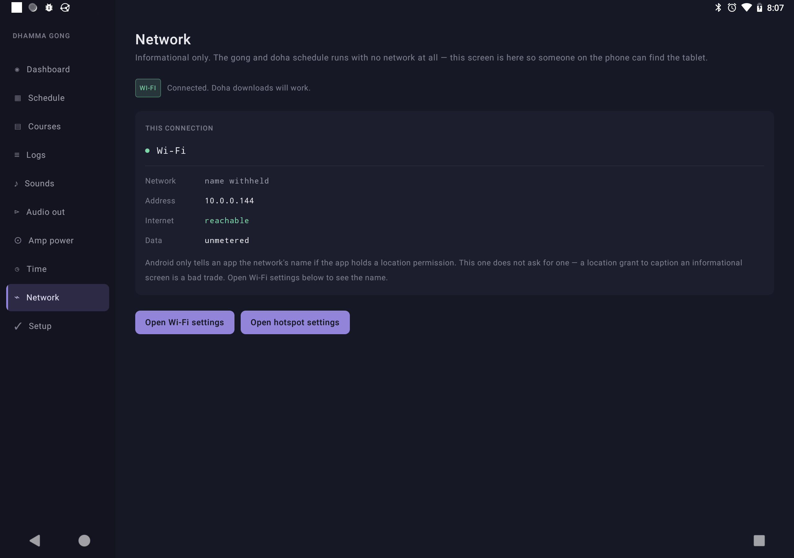

# Screenshots

Product screens for GitHub / docs. Captured from a USB **Google Pixel C**
(`ryu`, API 27) running the Niyam debug build.

## Capture settings

| Setting | Value |
|---------|--------|
| Device | Google Pixel C (tablet) |
| Orientation | Landscape |
| Resolution | **2560 × 1800** (device native) |
| Density | 320 dpi |
| Method | `adb shell screencap -p` + `adb pull` |
| App | `org.dhamma.gong` debug |

`adb exec-out screencap` is unreliable on this device (GPU log lines corrupt the
PNG stream). Prefer writing to `/sdcard` then `adb pull`.

Deep-link a tab (warm start keeps the activity unlocked):

```bash
adb shell am start -n org.dhamma.gong/.ui.MainActivity --es tab DASHBOARD
```

`tab` is a `Tab` enum name (case-insensitive): `DASHBOARD`, `SCHEDULE`,
`COURSES`, `LOGS`, `SOUNDS`, `AUDIO_OUT`, `POWER`, `TIME`, `NETWORK`, `SETUP`.

## Gallery

### Dashboard


Main dashboard: next gong hero, active course card, health, next events, test panel.


Lower band / scrolled view of the dashboard.

### Schedule


Day-column schedule grid with inspector.


Schedule after vertical scroll.

### Courses


Course table (start = zero day, status paint).


Further down the courses list.

### Logs


Play log with filter chips (UTC timestamps).


Logs after scroll.

### Sounds


Sounds / doha media mapping (top of screen).


Sounds mid-scroll.


Sounds lower section (pack / download area).

### Audio out


Audio route / output settings.

### Amp power


Mains / Shelly relay control (top).


Amp power lower section.

### Time


Appliance timezone vs device zone; clock confirm.

### Network



Network / connectivity screen.

### Setup


First-run checklist (notifications, exact alarms, battery, appliance state).


Setup after scroll.

### System


System notification shade showing the Gong foreground-service notification.

## File index

| File | Screen |
|------|--------|
| `01-dashboard.png` | Dashboard |
| `01b-dashboard-scrolled.png` | Dashboard (scrolled) |
| `02-schedule.png` | Schedule |
| `02c-schedule-vscroll.png` | Schedule (v-scroll) |
| `03b-courses-scrolled.png` | Courses |
| `03c-courses-lower.png` | Courses (lower) |
| `04-logs.png` | Logs |
| `04b-logs-scrolled.png` | Logs (scrolled) |
| `05-sounds.png` | Sounds |
| `05c-sounds-scrolled-more.png` | Sounds (scrolled) |
| `05d-sounds-bottom.png` | Sounds (bottom) |
| `06-audio-out.png` | Audio out |
| `07-amp-power.png` | Amp power |
| `07b-amp-power-scrolled.png` | Amp power (scrolled) |
| `08-time.png` | Time |
| `09-network.png` | Network |
| `10-setup.png` | Setup |
| `10b-setup-scrolled.png` | Setup (scrolled) |
| `12-notification-shade.png` | Notification shade |

## Re-shoot

```bash
export ANDROID_HOME=/Users/wizops/Android/Sdk
export PATH="$ANDROID_HOME/platform-tools:$PATH"
SERIAL=<device-serial>
OUT=docs/screenshots
adb -s "$SERIAL" shell am start -n org.dhamma.gong/.ui.MainActivity --es tab DASHBOARD
adb -s "$SERIAL" shell screencap -p /sdcard/niyam_shot.png
adb -s "$SERIAL" pull /sdcard/niyam_shot.png "$OUT/01-dashboard.png"
```
