# Screenshots

Product screens for GitHub / docs. Captured from the debug build on an emulator
forced to the **appliance target surface**.

## Capture settings

| Setting | Value |
|---------|--------|
| Orientation | **Landscape** (app locks with `android:screenOrientation="landscape"`) |
| Resolution | **1280 × 800** logical pixels |
| Density | **160 dpi** (1 dp ≈ 1 px) |
| AVD used | `cca34` (API 34) with `adb shell wm size 1280x800` + `wm density 160` |
| App version | `0.2.0-beta1` (`org.dhamma.gong`) for the `1x-beta-*` shots; `0.1.0-mvp` for the earlier `0x-*` set |

Design target is a ~10″ tablet in landscape (Nocturne UI). Phone-shaped AVDs
should be overridden with `wm size` / `wm density` before re-shooting.

### Beta screen review (`0.2.0-beta1`)

Shot after the beta screen review pass. Same surface: `wm size 1280x800`,
`wm density 160`, landscape, AVD `cca34`.

Deep links now work on a warm start, so tabs can be driven without a
force-stop:

```bash
adb shell am start -n org.dhamma.gong/.ui.MainActivity -e tab DASHBOARD
```

`tab` takes the enum name: `DASHBOARD`, `SCHEDULE`, `COURSES`, `LOGS`,
`SECURITY` (the PIN tab), `TIME`, `SETUP`. Parsing is case-insensitive.
Add `-S` only when you deliberately want a cold start or a re-locked PIN.

| Shot | State |
|------|-------|
| 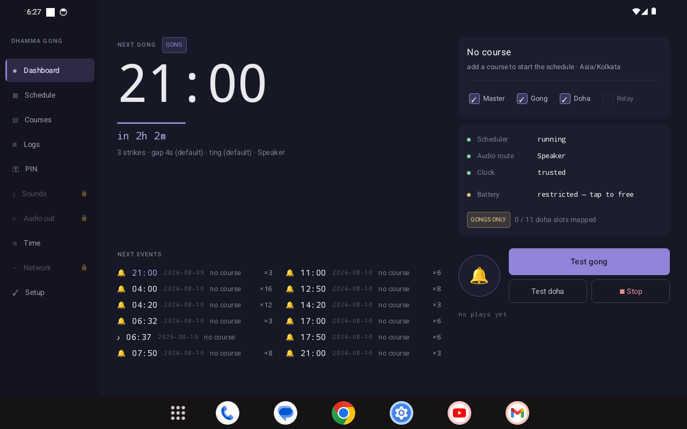 | **Dashboard, first run.** No course, so the card carries the appliance zone alongside the prompt. GONGS ONLY chip with the doha slot count; amber battery row is tappable. |
| 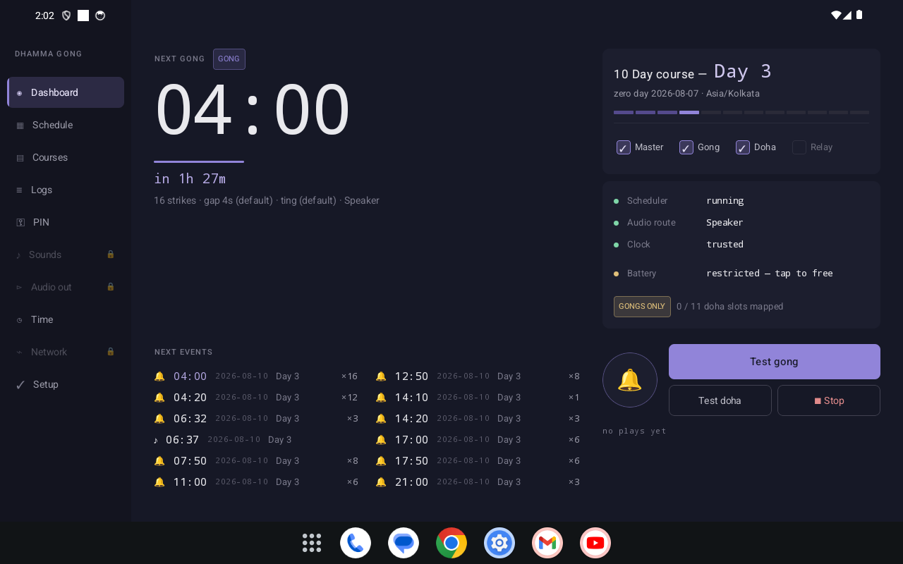 | **Dashboard, 10 Day active.** Day progress segments, next-events columns, test panel with Stop unclipped. |
| 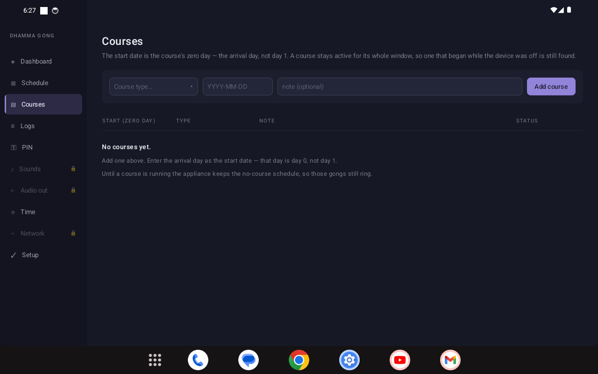 | **Courses, first run.** The empty state that replaced a bare header: arrival day is day 0, and the no-course schedule still rings. |
| 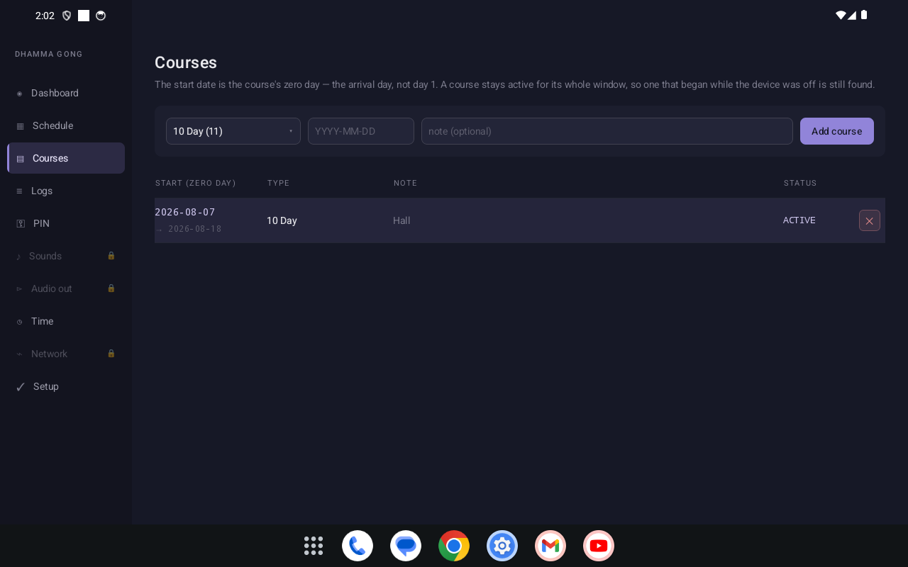 | **Courses with a course.** ACTIVE paint and the window end date under the start date. |
| 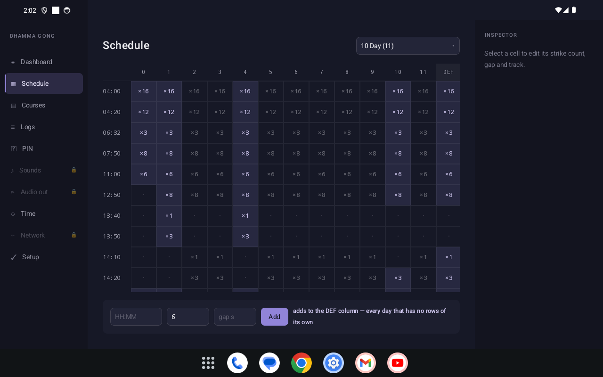 | **Schedule, 10 Day.** Days with no rows of their own render their inherited DEF rows dimmed instead of blank; the wall-clock gutter stays pinned when the grid scrolls. |
| 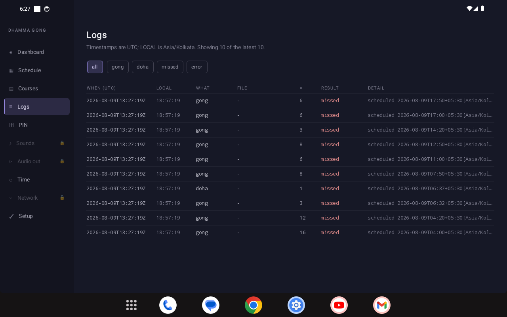 | **Logs, empty.** |
| 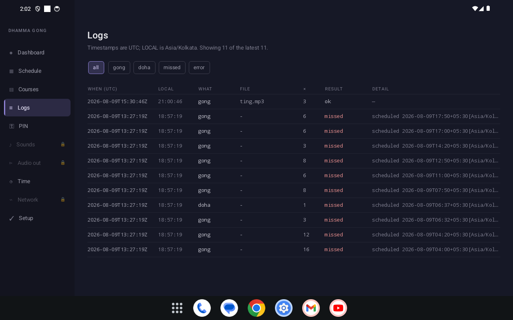 | **Logs after a test gong.** UTC stays canonical with the appliance-local column beside it; `ok` against `missed` colouring. |
| 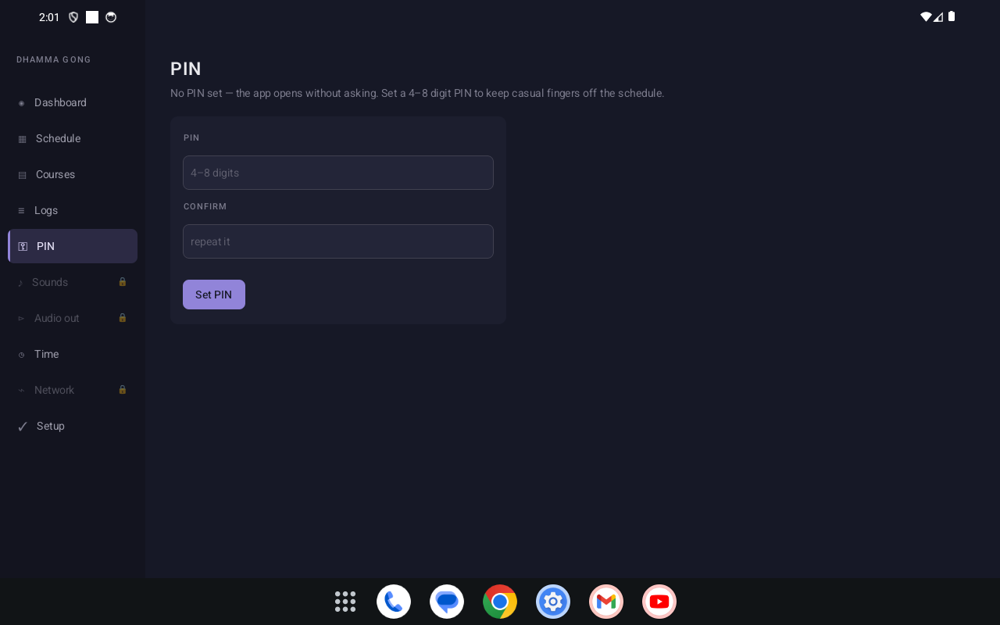 | **PIN / Security.** |
| 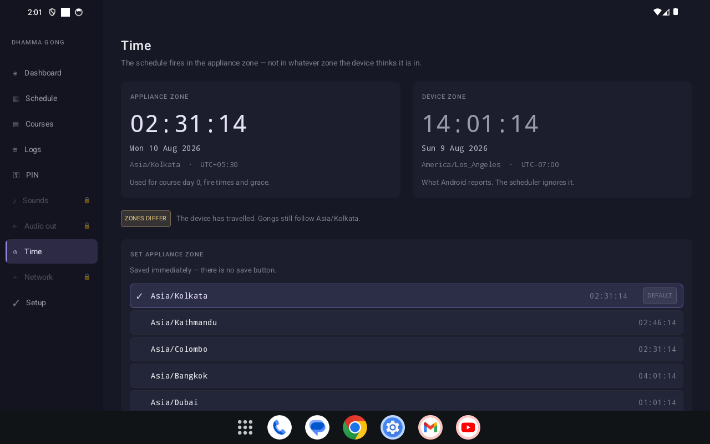 | **Time (new).** Appliance zone against device zone — the emulator sits in `America/Los_Angeles` while the appliance runs `Asia/Kolkata`, which is the whole reason the setting exists. |
| 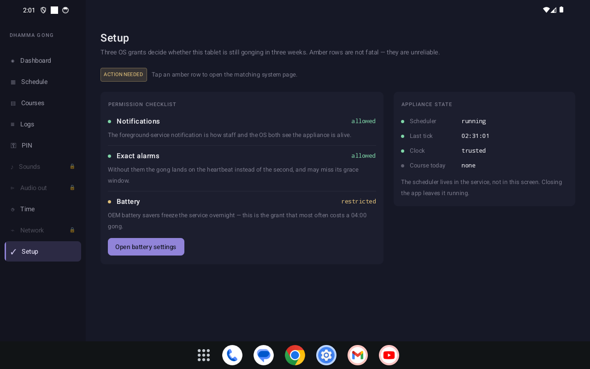 | **Setup (new).** Permission checklist bound to real status, plus live appliance state. |

Always restore the emulator afterwards:

```bash
adb shell wm size reset
adb shell wm density reset
```

## Gallery

### Launcher icon

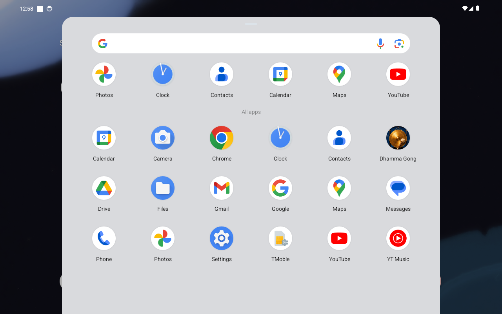

Brand gong artwork as the adaptive launcher icon (`@mipmap/ic_launcher`). Source art lives under [`docs/branding/`](../branding/).

### 1. Installation


After installing the debug APK, the system **App info** page for **Dhamma Gong**
(`org.dhamma.gong`, version `0.1.0-mvp`).

```bash
adb install -r app/build/outputs/apk/debug/app-debug.apk
```

### 2. Main dashboard

#### Idle (no course)


Scheduler running, clock trusted, **No course** — between-course / first-run state.
**GONGS ONLY** when doha media slots are unmapped.

#### Active course


Active course card, next gong hero time, next-events list, health strip, test
gong / doha / stop. Appliance timezone shown as **Asia/Kolkata**.

### 3. Critical working / settings

#### Courses


Add course (type + zero-day start date), active row highlighted.

#### Schedule


Day columns 0…N + **DEF** (mid-course default), strike counts, inspector for edits.

#### Logs


UTC timestamps, filters, `missed` / result colouring — staff diagnostics.

#### PIN


Optional 4–8 digit PIN (salted PBKDF2). Empty = open app without a gate.

## Re-capture (maintainers)

```bash
# Emulator surface
adb shell settings put system accelerometer_rotation 0
adb shell settings put system user_rotation 1
adb shell wm size 1280x800
adb shell wm density 160

# Optional deep-link tab (after force-stop):
#   DASHBOARD | COURSES | SCHEDULE | LOGS | SECURITY
adb shell am force-stop org.dhamma.gong
adb shell am start -n org.dhamma.gong/.ui.MainActivity --es tab COURSES
adb exec-out screencap -p > docs/screenshots/04-courses.png
```

Nav items also expose `content-desc` values `nav_DASHBOARD`, `nav_COURSES`, etc.
for automation.
