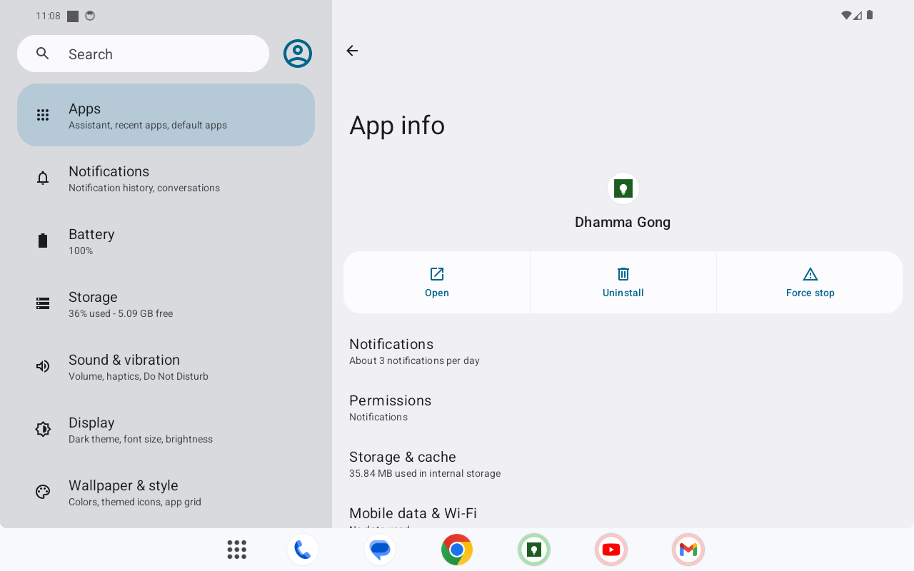
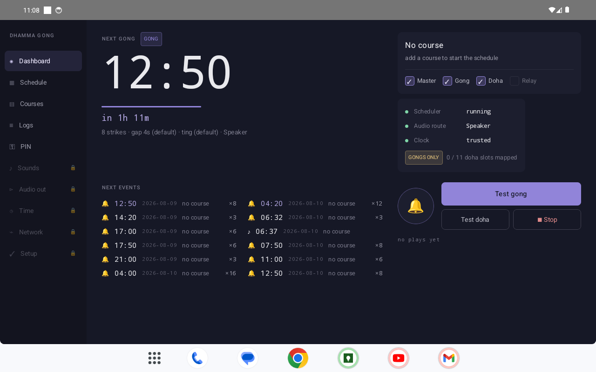
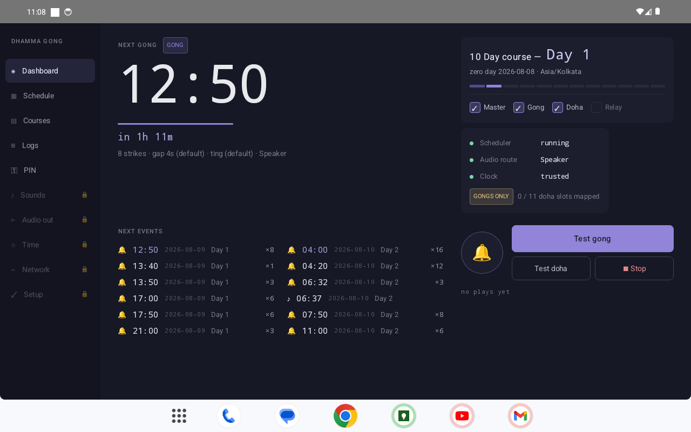
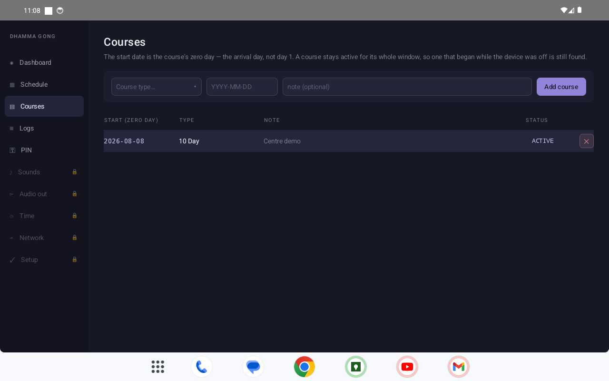
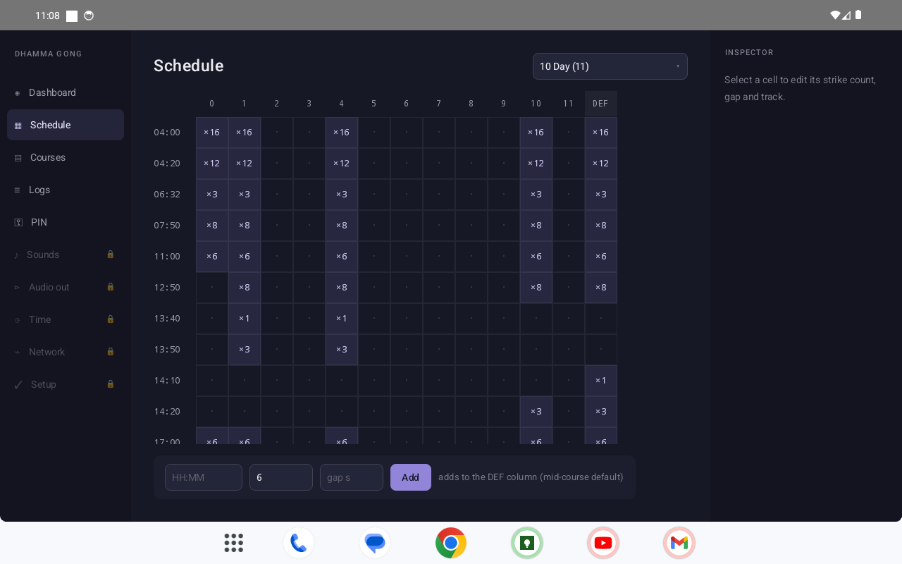
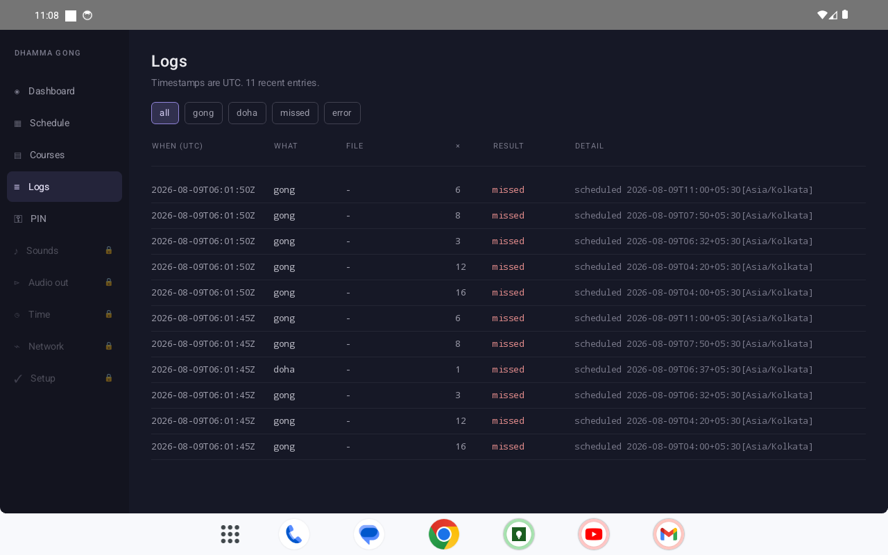
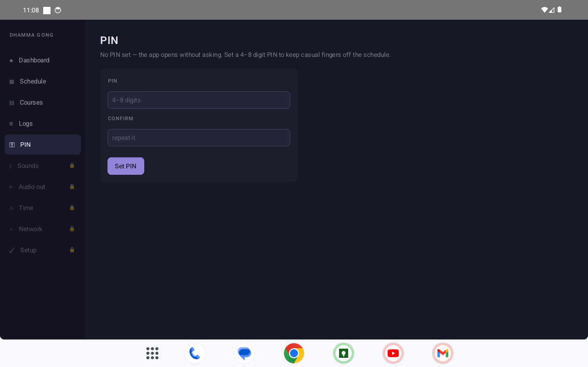

# Screenshots

Product screens for GitHub / docs. Captured from the debug build on an emulator
forced to the **appliance target surface**.

## Capture settings

| Setting | Value |
|---------|--------|
| Orientation | **Landscape** (app locks with `android:screenOrientation="landscape"`) |
| Resolution | **1280 × 800** logical pixels |
| Density | **160 dpi** (1 dp ≈ 1 px) |
| AVD used | `cca34` (API 34) with `adb shell wm size 1280x800` + `wm density 160` |
| App version | `0.1.0-mvp` (`org.dhamma.gong`) |

Design target is a ~10″ tablet in landscape (Nocturne UI). Phone-shaped AVDs
should be overridden with `wm size` / `wm density` before re-shooting.

## Gallery

### 1. Installation



After installing the debug APK, the system **App info** page for **Dhamma Gong**
(`org.dhamma.gong`, version `0.1.0-mvp`).

```bash
adb install -r app/build/outputs/apk/debug/app-debug.apk
```

### 2. Main dashboard

#### Idle (no course)



Scheduler running, clock trusted, **No course** — between-course / first-run state.
**GONGS ONLY** when doha media slots are unmapped.

#### Active course



Active course card, next gong hero time, next-events list, health strip, test
gong / doha / stop. Appliance timezone shown as **Asia/Kolkata**.

### 3. Critical working / settings

#### Courses



Add course (type + zero-day start date), active row highlighted.

#### Schedule



Day columns 0…N + **DEF** (mid-course default), strike counts, inspector for edits.

#### Logs



UTC timestamps, filters, `missed` / result colouring — staff diagnostics.

#### PIN



Optional 4–8 digit PIN (salted PBKDF2). Empty = open app without a gate.

## Re-capture (maintainers)

```bash
# Emulator surface
adb shell settings put system accelerometer_rotation 0
adb shell settings put system user_rotation 1
adb shell wm size 1280x800
adb shell wm density 160

# Optional deep-link tab (after force-stop):
#   DASHBOARD | COURSES | SCHEDULE | LOGS | SECURITY
adb shell am force-stop org.dhamma.gong
adb shell am start -n org.dhamma.gong/.ui.MainActivity --es tab COURSES
adb exec-out screencap -p > docs/screenshots/04-courses.png
```

Nav items also expose `content-desc` values `nav_DASHBOARD`, `nav_COURSES`, etc.
for automation.
